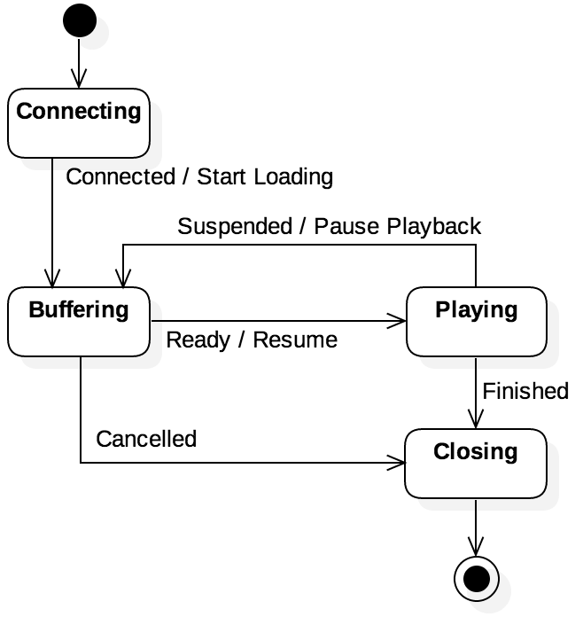

UML state models are one way to visualize the behavior of a system from the perspective of its states and transitionzs. Figure above shows an example of a state model for a streaming media player. The player has four states: `Connecting`, `Buffering`, `Playing` and `Closing`. The arrows between states denote transitions, with the following events defined: `Connected`, `Ready`, `Suspended`, `Cancelled`, and `Finished`. These events correspond to both user input, as well as issues such as running out of buffered data.