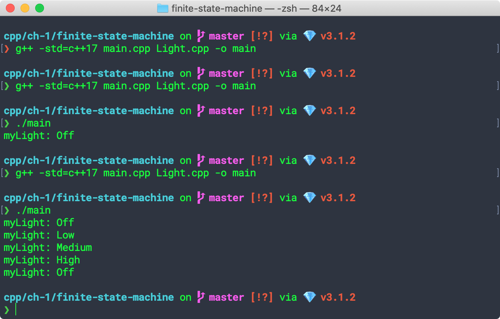

## Implementing a Finite State Machine in C++

[Source](https://www.aleksandrhovhannisyan.com/blog/implementing-a-finite-state-machine-in-cpp/)

Approach 1

```
make clean
make
./main
```

Result:

